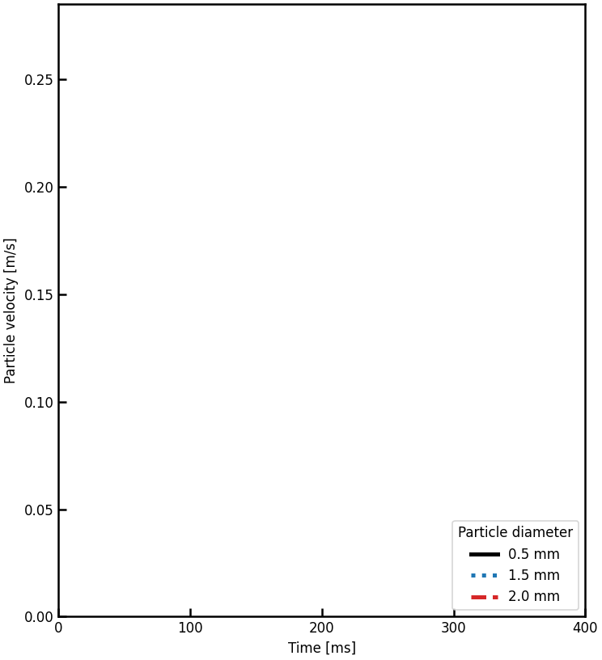

# HGFD paper reproduction

This repository contains a best-effort reproduction of Li et al.,
[*Coupling Heterarchical Granular Dynamics and Computational Fluid Dynamics*](https://arxiv.org/abs/2606.23202)
(2026). It implements the published HGFD equations and supplies three runnable
configurations for the paper's single-particle settling validation.

## Reproduced Case 1 result

Run the three configurations and generate the comparison plot:

```bash
python HGD/main.py json/hgfd_paper_case1_0p5mm.json5
python HGD/main.py json/hgfd_paper_case1_1p5mm.json5
python HGD/main.py json/hgfd_paper_case1_2p0mm.json5
python scripts/plot_hgfd_case1.py
```



A high-resolution [static PNG](images/hgfd_case1_reproduction.png) is also
provided for reports and presentations.

The terminal velocities from the full two-way-coupled runs are:

| Diameter | Paper HGFD curve | This reproduction | Relative difference |
| ---: | ---: | ---: | ---: |
| 0.5 mm | 0.07425 m/s | 0.07452 m/s | +0.36% |
| 1.5 mm | 0.21144 m/s | 0.21168 m/s | +0.11% |
| 2.0 mm | 0.26153 m/s | 0.26170 m/s | +0.07% |

The paper's experimental time-series values are not published numerically, so
the plot contains reproduced HGFD curves rather than digitised experimental
markers.

## Parity with the paper

The implementation follows the published model for:

- buoyancy-modified gravity and layer-wise exponential drag relaxation;
- Gidaspow drag, using Wen--Yu below solid fraction 0.2 and Ergun above it;
- the `1 / M_s` layer normalisation and sum-to-cell drag aggregation;
- directional stochastic advection and concentration-dependent diffusion;
- the strict total-transition-probability constraint `P_tot < 0.5`;
- the virtual-displacement momentum-transfer budget, including carry-over
  after a realised swap;
- one staggered HGD-then-CFD update and one field exchange per time step;
- fluid-fraction-weighted continuity and momentum transport on a co-located
  cell-centred grid;
- Euler time integration, LUST convective interpolation, linear gradients,
  and uncorrected orthogonal viscous fluxes.

The particle relaxation uses the per-coordinate mass density `rho_p / M`.
This factor is implicit in the heterarchical layer volume and is required to
reproduce Figure 4. Applying the printed `tau = rho_p / beta_k` literally,
without this layer-mass normalisation, does not reproduce the published curve.

The fluid receives `beta * (u_s - u_f)`, equal and opposite to the drag on the
solid. The paper prints `beta * (u_f - u_s)` as a positive fluid source but
also states that the force is equal and opposite; those two statements have
opposite signs. The implementation chooses the momentum-conserving sign.

## What cannot be reproduced one-to-one from public material

The authors' CFD participant is an extended OpenFOAM `pisoFoam` solver coupled
through preCICE. Its source, preCICE configuration, PISO corrector settings,
and exact OpenFOAM boundary dictionaries are not included in the paper or the
public HGD repository. The bundled Python finite-volume projection solver
matches the published equations and named spatial discretisations. Its
nonlinear transport is evaluated once before the pressure projection, so it
is not matrix-, PISO-iteration-, or binary-identical to that unpublished
participant.

Other public-data limits are:

- Case 1 lists 15 horizontal cells of size 0.05 m but also a 1.1 m domain
  width. Those values imply 0.75 m and cannot all hold simultaneously. The
  runnable configurations preserve the published cell count and cell size.
- Case 2 does not publish the numerical initial particle-size distribution.
- Cases 3 and 4 refer to external experiments for complete geometry and use
  calibrated feeding/mixing conditions that are not tabulated numerically.

Consequently, Case 1 is quantitatively reproducible from public inputs, while
honest one-to-one reproduction of all four cases requires the authors' missing
solver participant, coupling files, geometries, and raw initial/experimental
data.
